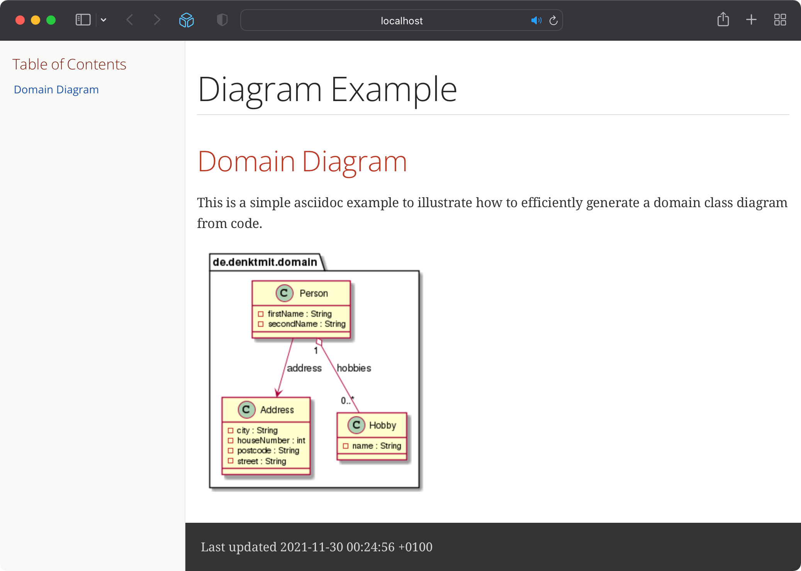

# Express Your Domain Classes with Asciidoctor and PlantUML

Expressive and rich domain classes gained a growing popularity with the rise of Domain-Driven Design, which was 
coined by Eric Evans by his book "Domain-Driven Design: Tackling Complexity in the Heart of Software" and the growing popularity of the Ports-and-Adapters software architecture.

Key to an expressive domain is the ubiquitous language, which is used both by the developers and the business people 
in your team. Developing such a ubiquitous language requires extensive collaboration between these two parties 
throughout a software development project. Discussing a well formatted diagram together with the business people is a 
lot easier, than looking at the actual code.

However, keeping such diagram up-to-date is a boring task, which can 
easily be forgotten. That is one reason why so many wiki pages are outdated one minute after you hit the save button 
on it.

Instead of having to update such pages, we want to generate the relevant documentation based on the actual code. 
This post will present you one easy way to integrate a workflow to generate a UML diagram based on your domain 
classes and render it within a asciidoc HTML document, which can be easily published as a static website.

Visualizing our domain classes in a HTML document, which can be easily published e.g. as a static website, 
is a two-step process:

1. We need to generade a PlantUML diagram file, which can be rendered into a PNG file
2. We need to add an asciidoc to our project, which includes and renders the generated PlantUML file.

## 1. Generate a PlantUML diagram

There are multiple maven plugins available, which can generate PlantUML syntax for given Java classes. 
We decided to use the [plantuml-generator-maven-plugin](https://github.com/devlauer/plantuml-generator), since it 
includes various well documented configuration options and includes support for generating the asciidoc wrapper.

The plugin can be configured within the `plugin` section of our `pom.xml`:

```xml
<plugin>
    <artifactId>plantuml-generator-maven-plugin</artifactId>
    <groupId>de.elnarion.maven</groupId>
    <version>1.2.0</version>
    <executions>
        <execution>
            <id>generate-simple-diagram</id>
            <goals>
                <goal>generate</goal>
            </goals>
            <phase>generate-test-sources</phase>
            <configuration>
                <outputDirectory>${build.directory}/classes/docs</outputDirectory>
                <outputFilename>domain.puml</outputFilename>
                <scanPackages>
                    <scanPackage>de.denktmit.domain</scanPackage>
                </scanPackages>
                <enableAsciidocWrapper>true</enableAsciidocWrapper>
            </configuration>
        </execution>
    </executions>
</plugin>
```
All classes within the package `de.denktmit.domain` will be included in the generated PlantUML file. The file will be 
generated in the directory `/target/classes/docs`. This directory is crucial, since we need to reference this file 
from within our asciidoc later.

## 2. Render Diagram within an Asciidoc
In this step we integrate the generated PlantUML file into an asciidoc file, which can be part of an existing 
documentation. The following asciidoc is a minimal example for rendering our PlantUML file:

```asciidoc
= Diagram Example

// Configuration for external diagram rendering service:
:diagram-server-url: https://kroki.io/
:diagram-server-type: kroki_io

== Domain Diagram

This is a simple asciidoc example to illustrate how to efficiently generate a domain class diagram from code.

// include the PlantUML diagram file
include::domain.puml[]
```

This files can be rendered into an HTML document with the help of the asciidoctor toolchain, which is also 
conveniently available as a maven plugin:
```xml
<plugin>
    <groupId>org.asciidoctor</groupId>
    <artifactId>asciidoctor-maven-plugin</artifactId>
    <version>${asciidoctor.version}</version>
    <dependencies>
        <dependency>
            <groupId>org.asciidoctor</groupId>
            <artifactId>asciidoctorj-diagram</artifactId>
            <version>${asciidoctor.version}</version>
        </dependency>
    </dependencies>
    <configuration>
        <sourceDirectory>${build.directory}/classes/docs</sourceDirectory>
        <requires>
            <require>asciidoctor-diagram</require>
        </requires>
    </configuration>
    <executions>
        <execution>
            <id>generate-html-doc</id>
            <phase>generate-test-resources</phase>
            <goals>
                <goal>process-asciidoc</goal>
            </goals>
            <configuration>
                <backend>html5</backend>
                <attributes>
                    <toc>left</toc>
                </attributes>
            </configuration>
        </execution>
    </executions>
</plugin>
```
Rendering a PlantUML diagram into a PNG file actually requires (graphviz)[https://graphviz.org] to be installed on 
the build host. Since this can be an issue especially in CI-environments, asciidoc includes support to use external 
services to render PlantUML and other diagram types. (Kroki)[https://korki.io] is one of these services which can 
also be self-hosted to avoid sending sensitive data to public webservices. In our example we configured the public Kroki
instance to be used to render our diagram within the asciidoc:

```
:diagram-server-url: https://kroki.io/
:diagram-server-type: kroki_io
```

## Publish Documentation

Running `mvn package` will execute the PlantUML generation and render the asciidoc as a HTML document afterwards. 
The result will look like this:



The document will be generated into the directory `target/generated-docs`. From here it can easily be published as a 
static website, e.g. using GitHub or Gitlab Pages.


